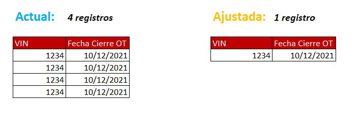
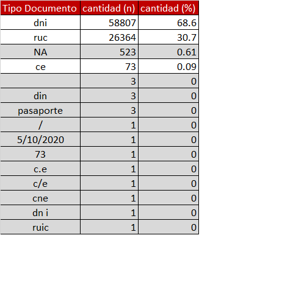
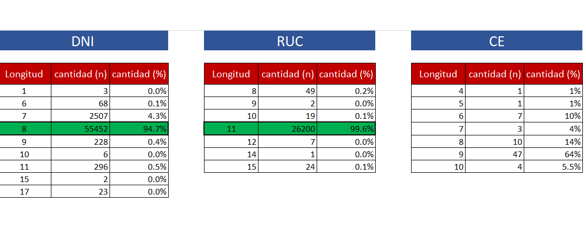
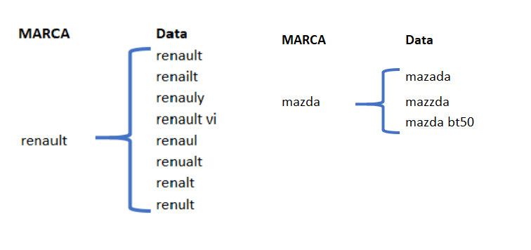
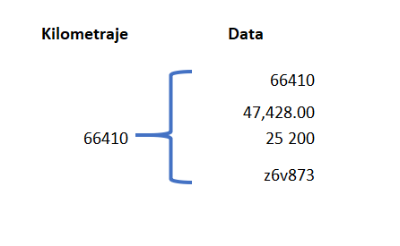

```{r setup, include=FALSE}

knitr::opts_chunk$set(echo = FALSE,# Prevents code but not the results
                      message = FALSE,
                      warning = FALSE)

knitr::opts_knit$set(root.dir = dirname(rstudioapi::getActiveDocumentContext()$path))
# https://towardsdatascience.com/five-r-markdown-tricks-that-you-may-not-know-about-71e93f50c026
```

# 1. Objetivo del Analisis

-   Detectar Patrones extraños en los registros Post Venta Ces.

-   Analizar la Calidad de los Datos en los registros Post Venta Ces.

# 2. Descripcion del Data set

**Dataset:** PostVenta de Concesionarios <br /> **Año**: Mar 2020 - Nov 2021. <br /> **Fuente :** *contactabilidad_ic.fuente.compartido_ces_postventas*. <br /> **Descripción:** Informacion de las transacciones de PostVenta de los concesionarios.

# 3. Descripcion de las Variables

<!-- **1. empresa** : Es el nombre comercial de la empresa.   -->

<!-- **2. alias** : Es el sobrenombre o el identificador por el cual es más conocida la empresa.   -->

<!-- **3. desc** : Es la industria nicho en la cual está ubicada la empresa.   -->

<!-- **4. sector** : Es el sector en el cual se desarrolla la empresa.   -->

<!-- **5. tamano** : Es el tamaño de la empresa donde 1 significa muy pequeño y 300 muy grande.   -->

<!-- **6. ingresos** : Es la cantidad de ingresos percibidos al año de la empresa(Millones de Dolares).   -->

<!-- **7. ransomware_cost** : Es la cantidad de dinero solicitada por el atacante por el rescate(Millones de Dolares).   -->

<!-- **8. ransomware_flag_pago** : Es el estado final del ataque donde se sabe si se pagó, no pago o no hay información.   -->

<!-- **9. ransomware_anio** : Es el año del ataque Ransomware.   -->

<!-- **10. ransomware_mes** : Es el mes del ataque Ransomware.   -->

<!-- **11. pais** : El país de la empresa.   -->

<!-- **12. hist_int** : Es la historia resumida del ataque.   -->

<!-- **13. ransomware** : Es el nombre del Ransomware utilizado por el atacante.   -->

<!-- **14. inicio** : Es la fecha desde que se tiene registro de los ingresos de la compañía.   -->

<!-- **15. url** : Es la página web de la noticia donde se puede encontrar más información del ataque.   -->

# 4. Analisis Exploratorio de Datos

```{r librerias}
suppressPackageStartupMessages(library(odbc))
suppressPackageStartupMessages(library(lares))
suppressPackageStartupMessages(library(readxl))
suppressPackageStartupMessages(library(ggtext))
suppressPackageStartupMessages(library(scales))
suppressPackageStartupMessages(library(forcats))
suppressPackageStartupMessages(library(stringr))
suppressPackageStartupMessages(library(stringi))
suppressPackageStartupMessages(library(ggplot2))
suppressPackageStartupMessages(library(ggrepel))
suppressPackageStartupMessages(library(magrittr))
suppressPackageStartupMessages(library(lubridate))
suppressPackageStartupMessages(library(tidyverse))
suppressPackageStartupMessages(library(patchwork))
suppressPackageStartupMessages(library(data.table))
suppressPackageStartupMessages(library(kableExtra))
suppressPackageStartupMessages(library(formattable))
suppressPackageStartupMessages(library(DataExplorer))
suppressPackageStartupMessages(library(summarytools))

```

## 4.1 Estructura de la informacion

```{r}
# 
# con <- DBI::dbConnect(odbc(),
#                       Driver = "SQL Server",
#                       Server = "10.110.20.59",
#                       Database = "contactabilidad_ic",
#                       UID = "user_ic",
#                       PWD = "Derco.2020")
# 
# icd <- dbGetQuery(conn = con,"SELECT * FROM fuente.compartido_ces_postventas")
# 
# tipo_serv <- dbGetQuery(conn = con,"SELECT * FROM [dwh_derco].[dbo] .[DIM_TIPO_SERVICIO]")

setwd("C:/Users/dincappuenot/OneDrive - Grupo Derco/Escritorio/ICD -Concesionario Post Venta")

icd <- read_rds("01.Data/Base_icd_2021_12_10.rds")
tipo_serv <- read_rds("01.Data/tipo_servicio_2021_12_22.rds")


```

```{r}


kable(icd %>% head(10) %>% t() %>% as.data.frame )

```

```{r }

# view(dfSummary(icd),file = "Resumen/resumen_original.html")

```

[Resumen Original](Resumen/resumen_original.html)

```{r}

icd$fecha_cierre_ot %<>% ymd

# icd$razonsocial_concesionario <- str_replace_all(icd$razonsocial_concesionario, "�", "")
icd$razonsocial_concesionario <- str_replace_all(icd$razonsocial_concesionario, "[^[:alnum:]]"," ")


icd$anio_cierre_ot <- icd$fecha_cierre_ot %>% year

icd_mu <- icd %>% 
  filter(fecha_cierre_ot >= "2020-03-01")

# view(dfSummary(icd_mu),file = "Resumen/resumen_02.html")
  

```

[Resumen a partir de Marzo 2020](Resumen/resumen_02.html)

```{r tratamiento-de-datos}

icd_mu$numero_documento <-  stri_enc_toutf8(icd_mu$numero_documento, is_unknown_8bit = FALSE, validate = TRUE)
icd_mu$razon_social <-  stri_enc_toutf8(icd_mu$razon_social, is_unknown_8bit = FALSE, validate = TRUE)
icd_mu$tipo_cliente <-  stri_enc_toutf8(icd_mu$tipo_cliente, is_unknown_8bit = FALSE, validate = TRUE)
icd_mu$placa <-  stri_enc_toutf8(icd_mu$placa, is_unknown_8bit = FALSE, validate = TRUE)
icd_mu$detalle <-  stri_enc_toutf8(icd_mu$detalle, is_unknown_8bit = FALSE, validate = TRUE)

icd_mu$autorizacion_de_datos <-  stri_enc_toutf8(icd_mu$autorizacion_de_datos, is_unknown_8bit = FALSE, validate = TRUE)


# Removiendo espacios en blanco
icd_mu %<>% mutate_if(is.character,str_trim)

# Transformado a Minusculas
icd_mu %<>% mutate_if(is.character,str_to_lower)

# Transformacion de Variables fechata


# # Recodificando la Variable razonsocial_concesionario
icd_mu %<>% mutate(razonsocial_concesionario = case_when(razonsocial_concesionario %in% c("e rimassa s a c") ~ "erimassa s a c",
                                                         TRUE ~ razonsocial_concesionario
                                                         ))


# atack_rw$ransomware <- ifelse(atack_rw$ransomware=='not revealed','unknown',atack_rw$ransomware)

# view(dfSummary(icd_mu),file = "Resumen/resumen_03.html")

```

## 4.2 Analisis del Nivel de Completitud en los Datos

```{r}

icd_missing <- icd_mu %>% 
  purrr::set_names(str_to_upper)

plot_missing <- function(data,
                         group = list("Good" = 0.05, "OK" = 0.4, "Bad" = 0.8, "Remove" = 1),
                         missing_only = FALSE,
                         geom_label_args = list(),
                         title = NULL,
                         ggtheme = theme_gray(),
                         theme_config = list("legend.position" = c("bottom"))) {
  ## Declare variable first to pass R CMD check
  num_missing <- pct_missing <- Band <- NULL
  ## Profile missing values
  missing_value <- data.table(profile_missing(data))
  if (missing_only) missing_value <- missing_value[num_missing > 0]
  ## Sort group based on value
  group <- group[sort.list(unlist(group))]
  invisible(lapply(seq_along(group), function(i) {
    if (i == 1) {
      missing_value[pct_missing <= group[[i]], Band := names(group)[i]]
    } else {
      missing_value[pct_missing > group[[i-1]] & pct_missing <= group[[i]], Band := names(group)[i]]
    }
  }))
  ## Create ggplot object
  output <- ggplot(missing_value, aes_string(x = "feature", y = "num_missing", fill = "Band")) +
    geom_bar(stat = "identity") +
    scale_fill_discrete("Band") +
    coord_flip() +
    xlab("Variables") + ylab("Cantidad de OTs Vacias") +
    guides(fill = guide_legend(override.aes = aes(label = "")))
  geom_label_args_list <- list("mapping" = aes(label = paste0(round(100 * pct_missing, 2), "%")))
  output <- output +
    do.call("geom_label", c(geom_label_args_list, geom_label_args))
  ## Plot object
  class(output) <- c("single", class(output))
  plotDataExplorer(
    plot_obj = output,
    title = title,
    ggtheme = ggtheme,
    theme_config = theme_config
  )
}

plot_missing(icd_missing,missing_only = T,ggtheme = theme_classic())

```

**Insights:**

-   Hay OTs donde no se registrado el dato de correo, VIN, numero documento, placa.

-   Hay un nivel significativo de OTs \~12% donde no se registro el nombre del tecnico que atendio el vehiculo.

-   Los datos como el nombre y apellido del cliente estan casi vacios(\~100%) en todos los concesionarios.

## 4.3 Analisis de VIN, NUM. DOC., PLACA en los concesionarios {.tabset .tabset-fade}

### Analisis VIN

```{r analisis-vin}

icd_mu %>% 
  filter(is.na(vin)) %>% 
  count(anio_cierre_ot,razonsocial_concesionario) %>% 
  mutate(razonsocial_concesionario=str_to_title(razonsocial_concesionario)) %>% 
  ggplot(aes(x=n,
             y=reorder(razonsocial_concesionario,n),
             fill=as.character(anio_cierre_ot),
             label=n) )+
  geom_bar(stat="identity")+
  geom_text(nudge_x = 0.35,size=8)+
  facet_wrap(~anio_cierre_ot,scales = "free_y",nrow = 2)+
  theme_bw()+
  theme(legend.position = "none",
        axis.text.x = element_blank())+
  labs(y=NULL,x="Cantidad de OTs")
  


```

### Analisis NUM. DOC.

```{r analisis-num-doc}

icd_mu %>% 
  filter(is.na(numero_documento)) %>% 
  count(anio_cierre_ot,razonsocial_concesionario) %>% 
  mutate(razonsocial_concesionario=str_to_title(razonsocial_concesionario)) %>% 
  ggplot(aes(x=n,
             y=reorder(razonsocial_concesionario,n),
             fill=as.character(anio_cierre_ot),
             label=n) )+
  geom_bar(stat="identity")+
  geom_text(nudge_x = 2,size=8)+
  facet_wrap(~anio_cierre_ot,scales = "free_y",nrow = 2)+
  theme_bw()+
  theme(legend.position = "none",
        axis.text.x = element_blank())+
  labs(y=NULL,x="Cantidad de OTs")
  

```

### Analisis PLACA

```{r analisis-placa}

icd_mu %>% 
  filter(is.na(placa)) %>% 
  count(anio_cierre_ot,razonsocial_concesionario) %>% 
  mutate(razonsocial_concesionario=str_to_title(razonsocial_concesionario)) %>% 
  ggplot(aes(x=n,
             y=reorder(razonsocial_concesionario,n),
             fill=as.character(anio_cierre_ot),
             label=n) )+
  geom_bar(stat="identity")+
  geom_text(nudge_x = 2,size=8)+
  facet_wrap(~anio_cierre_ot,scales = "free_y",nrow = 2)+
  theme_bw()+
  theme(legend.position = "none",
        axis.text.x = element_blank())+
  labs(y=NULL,x="Cantidad de OTs")
  

```

## 4.4 Distribucion de OT por concesionario {.tabset .tabset-fade}

### Metodologia



### Analisis

```{r Distribucion de OT por concesionario}

dt_icd_mu <- data.table::data.table(icd_mu)

# Comparacion de Numero de OTs entre el original y cambiando a 1 ot por cierre ot y vin 


# Original: Numero de transacciones por concesionario y año 
orig_count <- icd_mu %>% 
  count(anio_cierre_ot,razonsocial_concesionario) %>% 
  rename(n_original=n)

# Ajutado: Numero de transacciones por concesionario y año 

ajus_count <- dt_icd_mu[,.N,by=c("fecha_cierre_ot","vin","razonsocial_concesionario")] %>% 
  as.data.frame %>% 
  mutate(anio_cierre_ot = year(fecha_cierre_ot)) %>% 
  count(anio_cierre_ot,razonsocial_concesionario) %>% 
  rename(n_ajustado=n)

dist_ot_ces <- orig_count %>% left_join(ajus_count,by = c("anio_cierre_ot","razonsocial_concesionario"))
rm(orig_count,ajus_count)

dist_ot_ces %<>% 
  mutate(n_incremento = n_original-n_ajustado,
         pct_incremento = (n_original-n_ajustado)/n_ajustado,
         razonsocial_concesionario_id = as.factor(razonsocial_concesionario),
         razonsocial_concesionario_id = as.integer(razonsocial_concesionario_id),
         ) 

# Grafica 2020

ot_2020 <- dist_ot_ces %>% 
  filter(anio_cierre_ot=="2020") %>%  
  mutate(razonsocial_concesionario_id = as.character(razonsocial_concesionario_id),
         razonsocial_concesionario_id = fct_reorder(razonsocial_concesionario_id, n_original, .desc = FALSE)) %>% 
  ggplot(aes(y=razonsocial_concesionario_id))+
  geom_segment(aes(
      x = n_ajustado,
      xend = n_original,
      y = razonsocial_concesionario_id,
      yend = razonsocial_concesionario_id),
    size = 2,color = "gray89")+
  geom_point(aes(x = n_original),size=2,color="#4169E1")+
  geom_point(aes(x = n_ajustado),size=2,color="darkorange")+
  geom_label_repel(aes(x=n_original,label=paste0("n: ",n_incremento,"(",percent(pct_incremento),")")),nudge_x = -0.1, direction = "y", size=2.2,nudge_y = 0.2)+
  theme_bw()+
  theme(axis.text.y = element_text(size=12))+
  labs(x="Cantidad de OT",
       y="Razon social Concesionario ID",
       # title = "<span style = 'color: red;'>Virginica irises</span> have the largest average sepal width")+
       title = "Comparacion entre la metodologia <span style = 'color: darkorange;'>ajustada</span> vs <span style = 'color: #4169E1;'>actual</span> - 2020")+
  theme(plot.title = element_markdown(size = 17),
        plot.title.position = "plot")

# Grafica 2021  

ot_2021 <- dist_ot_ces %>% 
  filter(anio_cierre_ot=="2021") %>%  
  mutate(razonsocial_concesionario_id = as.character(razonsocial_concesionario_id),
         razonsocial_concesionario_id = fct_reorder(razonsocial_concesionario_id, n_original, .desc = FALSE)) %>% 
  ggplot(aes(y=razonsocial_concesionario_id))+
  geom_segment(aes(
      x = n_ajustado,
      xend = n_original,
      y = razonsocial_concesionario_id,
      yend = razonsocial_concesionario_id),
    size = 2,color = "gray89")+
  geom_point(aes(x = n_original),size=2,color="#4169E1")+
  geom_point(aes(x = n_ajustado),size=2,color="darkorange")+
  geom_label_repel(aes(x=n_original,label=paste0("n: ",n_incremento,"(",percent(pct_incremento),")")),nudge_x = -0.1, direction = "y", size=2.2,nudge_y = 0.2)+
  theme_bw()+
  theme(axis.text.y = element_text(size=12))+
  labs(x="Cantidad de OT",
       y="Razon social Concesionario ID",
       # title = "<span style = 'color: red;'>Virginica irises</span> have the largest average sepal width")+
       title = "Comparacion entre la metodologia <span style = 'color: darkorange;'>ajustada</span> vs <span style = 'color: #4169E1;'>actual</span> - 2021")+
  theme(plot.title = element_markdown(size = 17),
        plot.title.position = "plot")

ot_2020 + ot_2021

# Distribucion de un correo con la cantidad de vines.

# Mismo Vin y diferente num documento o nombre.


```

### Diccionario de Concesionarios ID

```{r Distribucion de OT por concesionario2}

dist_ot_ces %>% 
  filter(anio_cierre_ot=="2021") %>%  
  mutate(razonsocial_concesionario_id = as.character(razonsocial_concesionario_id),
         razonsocial_concesionario_id = fct_reorder(razonsocial_concesionario_id, n_original, .desc = FALSE)) %>% 
  select(razonsocial_concesionario_id,razonsocial_concesionario) %>% 
  mutate(razonsocial_concesionario= str_to_title(razonsocial_concesionario)) %>% 
  DT::datatable(rownames = F)

```

## 4.5 Frecuencia de VINs por Correo y Concesionario {.tabset .tabset-fade}

-   En el 2020 la cantidad de autos relacionados con un correo va desde 1 a 229

-   En el 2021 la Cantidad de Autos relacionados con un correo va desde 1 a 794.

    Datos de Correo y concesionario con maxima cantidad de autos relacionados

    +------------+--------------------------------------------------------------------------------------------+------------------------------+
    | Año        | Email                                                                                      | Concesionario                |
    +============+============================================================================================+==============================+
    | 2020       | [eirigoins/\@automotorespakatnamu.com](mailto:eirigoins/@automotorespakatnamu.com){.email} | automotores pakatnamu s.a.c. |
    +------------+--------------------------------------------------------------------------------------------+------------------------------+
    | 2021       | [eirigoins/\@automotorespakatnamu.com](mailto:eirigoins/@automotorespakatnamu.com){.email} | automotores pakatnamu s.a.c. |
    +------------+--------------------------------------------------------------------------------------------+------------------------------+

```{r homologacion}

homologacion <- data.frame(
             stringsAsFactors = FALSE,
    razonsocial_concesionario = c("automotores pakatnamu s a c",
                                  "automotores pakatnamu selva s a c",
                                  "reparaciones y servicios del sur s a c",
                                  "automotriz y maquinarias motor mass s a c","motors show tarapoto s a c",
                                  "factoria gran prix scrltda","autoland s a",
                                  "pe aranda cars s a c",
                                  "autobacs import distribution   sales s a c","motorgas import s a c",
                                  "corsa automotriz s a c","gacsa peru s a c",
                                  "centro automotriz multimarca del peru s a c",
                                  "pacifico motors peru s a c","klm group s a c",
                                  "erimassa s a c","maqgama s a c",
                                  "b motors s a c","huanca autos s a c",
                                  "centro comercial san pedro s r l"),
  razonsocial_concesionario_2 = c("pakatnamu","pakatnamu selva","rep. y serv. del sur",
                                  "aut. y maq. motor mass",
                                  "motors show tarapoto","factoria gran prix","autoland",
                                  "peñaranda","autobacs import . dist. & sales",
                                  "motorgas","corsa automotriz","gacsa",
                                  "multimarca del peru","pacifico motors peru",
                                  "klm group","erimassa","maqgama","b motors",
                                  "huanca autos","c.c. san pedro")
)

```

### General

```{r general}

uni_email_vin <- icd_mu %>% 
  filter(!is.na(vin)) %>% 
  distinct(email_cliente,vin)

n_uni_email_vin<- uni_email_vin %>% 
  count(email_cliente)


n_uni_email_vin %>% 
  filter(n>1) %>% 
  mutate(
         n_cat = case_when(n<=3~"2-3",
                           n<=5~"4-5",
                           n<=10~"6-10",
                           n<=30~"11-30",
                           TRUE~">30",
                           ),
         n_cat = factor(n_cat,levels = c("2-3","4-5","6-10","11-30",">30"))
         ) %>% 
  
  ggplot(aes(x=n_cat))+
  geom_bar(fill="red",color="black")+
  theme_bw()+
  theme(legend.position = "none")+
  labs(y="Cantidad de Correos",
       x="Rango de VINs distintos")

```

### 2020

```{r 2020}


uni_email_vin_ces_2020 <- icd_mu %>% 
  filter(anio_cierre_ot=="2020",!is.na(vin)) %>% 
  distinct(email_cliente,vin,razonsocial_concesionario)

n_uni_email_vin_ces <- uni_email_vin_ces_2020 %>% 
  count(email_cliente,razonsocial_concesionario)

n_uni_email_vin_ces %<>% left_join(homologacion)

n_uni_email_vin_ces %>% 
  filter(n>1) %>% 
  mutate(razonsocial_concesionario_2 = str_to_title(razonsocial_concesionario_2),
         razonsocial_concesionario_2 = fct_reorder(razonsocial_concesionario_2,.x = n,.fun = sum,.desc =T),
         n_cat = case_when(n<=3~"2-3",
                           n<=5~"4-5",
                           n<=10~"6-10",
                           n<=30~"11-30",
                           TRUE~">30",
                           ),
         n_cat = factor(n_cat,levels = c("2-3","4-5","6-10","11-30",">30"))
         ) %>% 
  
  ggplot(aes(x=n_cat,fill=razonsocial_concesionario_2))+
  geom_bar()+
  theme_bw()+
  theme(legend.position = "none")+
  facet_wrap(~razonsocial_concesionario_2,scales = "free")+
  labs(y="Cantidad de Correos",
       x="Rango de VINs distintos")

  
```

### 2021

```{r 2021}

uni_email_vin_ces_2021 <- icd_mu %>% 
  filter(anio_cierre_ot=="2021",!is.na(vin)) %>% 
  distinct(email_cliente,vin,razonsocial_concesionario)

n_uni_email_vin_ces <- uni_email_vin_ces_2021 %>% 
  count(email_cliente,razonsocial_concesionario)

n_uni_email_vin_ces %<>% left_join(homologacion)

n_uni_email_vin_ces %>% 
  filter(n>1) %>% 
  mutate(razonsocial_concesionario_2 = str_to_title(razonsocial_concesionario_2),
         razonsocial_concesionario_2 = fct_reorder(razonsocial_concesionario_2,.x = n,.fun = sum,.desc =T),
         n_cat = case_when(n<=3~"2-3",
                           n<=5~"4-5",
                           n<=10~"6-10",
                           n<=30~"11-30",
                           TRUE~">30",
                           ),
         n_cat = factor(n_cat,levels = c("2-3","4-5","6-10","11-30",">30"))
         ) %>% 
  
  ggplot(aes(x=n_cat,fill=razonsocial_concesionario_2))+
  geom_bar()+
  theme_bw()+
  theme(legend.position = "none")+
  facet_wrap(~razonsocial_concesionario_2,scales = "free")+
  labs(y="Cantidad de Correos",
       x="Rango de VINs distintos")


```

# 5. Calidad de Datos

## 5.1 Calidad en Variable DNI y Tipo Documento {.tabset .tabset-fade}

### TIPO DOCUMENTO

La calidad del Tipo de Documento esta a un 99.39%, el resto tiene datos erroneos o mal escritos.



### DNI

Distribucion de Longitudes segun tipo Doumento



```{r longitud-tipo-documento,include=FALSE}

icd_mu %>% 
  filter(tipo_documento=="dni") %>% 
  pull(numero_documento) %>% str_length %>% table()

icd_mu %>% 
  filter(tipo_documento=="ruc") %>% 
  pull(numero_documento) %>% str_length %>% table()

icd_mu %>% 
  filter(tipo_documento=="ce") %>% 
  pull(numero_documento) %>% str_length %>% table()

```

-   Del total de DNI un 5.3%(3133) de los registros tiene una longitud distinta a 8.

-   Del total de RUC un 0.4%(102) de los registros tiene una longitud distinta a 11.

-   Del total de DNI un 100%(73) de los registros tiene una longitud distinta a 12.

[Informacion de la longitud por tipo de documento](http://www2.sunat.gob.pe/pdt/pdtModulos/independientes/p695/TipoDoc.htm)

## 5.2 Calidad en Celular del Cliente

La longitud del celular registrado va desde 0 o sin registro hasta 29 digitos.

Distribucion de la cantidad de digitos del celular:

```{r celular}

icd_mu %>% 
  mutate(len_cel=str_length(celular_cliente),
         cat_len_cel=ifelse(len_cel==9,"9","<>9")) %>% 
  filter(!is.na(cat_len_cel)) %>% 
  crosstab(cat_len_cel) %>% 
  select(-order,-pcum) %>% 
  rename("Longitud del Celular"=cat_len_cel,
         "Cantidad(n)"= n,
         "Cantidad(%)"= p,
         ) %>% 
  formattable()


```

-   Del total de celulares registrados un 3.5%(3050) de los registros tiene una longitud distinta a 9.

## 5.3 Calidad en Marca

```{r Marca, include=FALSE}
icd_mu$marca %>% unique %>% str_subset("ren")# Renault
icd_mu$marca %>% unique %>% str_subset("ren")# Renault
icd_mu$marca %>% unique %>% str_subset("maz")# mazda
icd_mu$modelo %>% unique %>% str_subset("maz")# mazda

```



-   Se observa que no se esta registrando correctamente la MARCA del vehiculo.

## 5.3 Calidad en Kilometraje

```{r kilometraje,include=FALSE}

icd_mu$kilometraje %>% str_subset(pattern = ",") %>% head
icd_mu$kilometraje %>% str_subset(pattern = " ") %>% head

icd_mu$kilometraje2 <- icd_mu$kilometraje %>% 
  str_replace(pattern = ",",replacement = "") %>% 
  str_replace(pattern = " ",replacement = "") %>% 
  as.numeric()


icd_mu %>%
  filter(is.na(kilometraje2)) %>%
  pull(kilometraje) %>%
  table(useNA = "ifany")

#
icd_mu %>% 
  mutate(kim_correcto = as.numeric(kilometraje),
         flag_kim_correcto = is.na(kim_correcto)) %>% 
  crosstab(flag_kim_correcto)


```



-   Del 100% de registros en kilometraje 7.4%(6390) no estan bien registrados o inclusive se registraron placas por error.

```{r,include=FALSE}


# icd_mu$kilometraje %<>% as.numeric

icd_mu$precio_mano_obra %<>% as.numeric

icd_mu$precio_repuestos %<>% as.numeric

icd_mu$precio_total %<>% as.numeric

icd_mu %>% select(contains("precio")) %>% glimpse

icd_mu %>%
  mutate(delta_precios = precio_total - precio_mano_repuestos) %>%
  filter(anio_cierre_ot=="2021") %>% 
  group_by(razonsocial_concesionario) %>% 
  summarise(precio_total_anio= sum(precio_total),
            precio_total_mano_repuestos=sum(precio_mano_repuestos)) %>% 
  ungroup() %>% 
  mutate(delta = precio_total_mano_repuestos- precio_total_anio,
         pct = percent(delta / precio_total_anio)) %>% 
  write.csv("Precios.csv")


icd_mu %>% 
  filter(razonsocial_concesionario=="autoland s a") %>% 
  crosstab(tipo_servicio)


icd_mu$tipo_servicio %>% unique


tipo_serv %>% head
tipo_serv$SERVICIO_DESCRIPCION %>% unique
tipo_serv$tipo_servicio %<>% str_to_upper()
icd_mu$tipo_servicio %<>% str_to_upper()

prueba <- icd_mu %>% 
  left_join(tipo_serv %>% select(tipo_servicio,SERVICIO_DESCRIPCION),
                               by="tipo_servicio")

prueba %>% 
  filter(is.na(SERVICIO_DESCRIPCION)) %>% 
  crosstab(tipo_servicio)

```

<!-- # 6. Conclusiones -->

<!-- -   No se registran los Datos de Nombre y apellido del cliente. -->

<!-- -   Hay missing en la columna vin. -->

<!-- -   Numero de OT repetidos por concesionario -->
